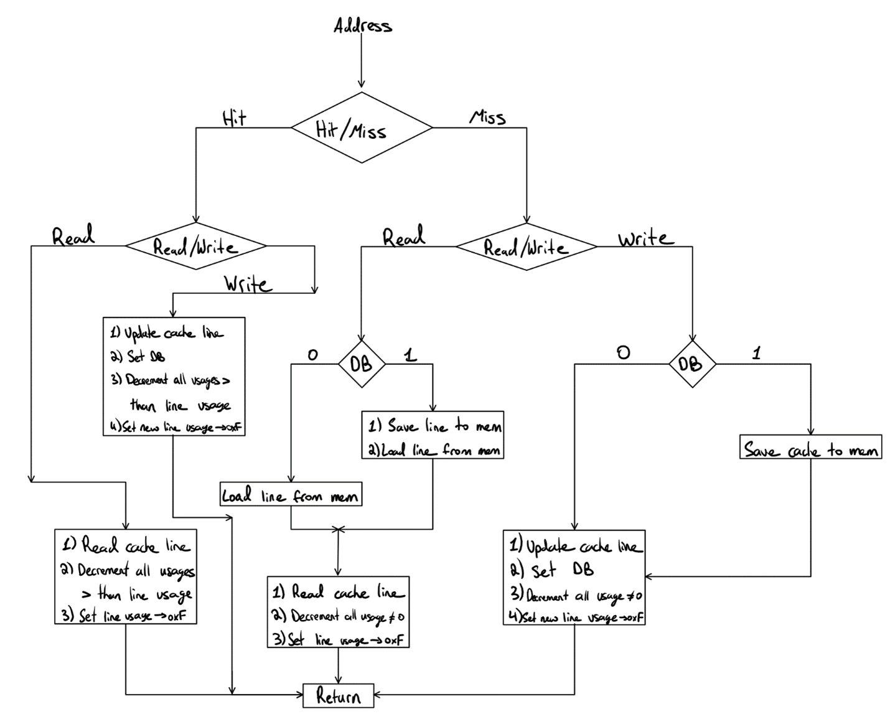
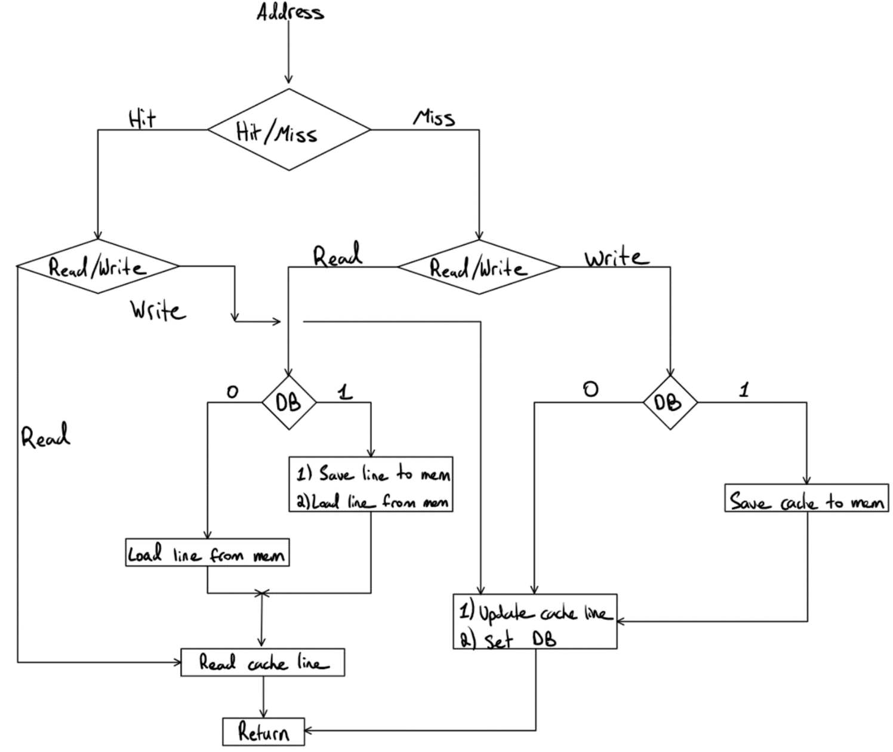

# XM23-Emulator
A built from the ground up emulator for the XM23 RISC architecture featuring full support of the XM23 assembly language.

## ReadMe contents
The following readme provides all the basic information one must know to use, operate, or develop for the XM23 emulator. The following outlines the contents of the document.

1. Introduction and Background
2. Important Information
    1. Must Knows
    2. Most Important Files
3. Developing Code
    1. ASM Files
    2. XME Files
    3. The XM23 Assembler
    4. How to Use
    5. Recommendations
4. Executing Code
5. Emulator Features
    1. The Main Menu
    2. The Debugger
        1. The "Continue" Statement
        2. Change PC
        3. Set New Breakpoint
        4. View Registers
        5. Modify Registers
        6. View Memory
        7. Modify Cache Type
    3. Output and Print Settings
6. Emulator Architecture
    1. The Loader
    2. Main Instruction Execution
        1. Fetch
        2. Decode
        3. Execute
    4. Memory Access
        1. Direct Cache
        2. Associative Cache
        3. Combined Cache
        4. Direct Memory Access 
7. XM23 Architecture
    1. RISC Architecture
    2. Registers
    3. Memory
    4. Cache
    5. Instructions

## Introduction and Background
The XM23 emulator was developed from the ground up in native C for the Computer Architecture course provided by Dalhousie University and led by Prof. Larry Hughes. This was an individual project that spanned the length of the entire semester (3+ months). The XM23 is a small power efficient RISC chip being developed by Dalhousie University. Third year Computer Engineering students were tasked with creating a fully functioning emulator for the chip that will support the entirety of the ISA. The ISA was provided to students at the start of the semester, and a significant portion of the development was done independently.

After the complition of the semester, I have added to, and optimized my implementation of the emulator. Additional features not required by the course are in the work and will be added with time.

## Important Information
This section outlines some important information regarding the emulator itself, as well as other important files and documents.

### Must Knows
The XM23 Emulator is based on the ISA developed by Prof. Larry Hughes. The most important features of the architecture are outlined in this README file, but for the full, detailed, specifics please refer to "XM-23 - ISA.pdf" Under "Full ISA". This document is over 100 pages long and outlines all the information about the architecture. Additionally, an up to date instruction set is available in "Revised XM23 Instruction Set.xlsx" under the same folder. Please refer to this instruction set and not the one outlined on the last page of the ISA. They have slight differences, and the emulator follows the "Revised XM23 Instruction Set.xlsx".

### Important Files
The emulator was built fully from the ground up with native C and does not have any external dependencies other than those in the C standard library. The following explains the file structure in the code base:
- emulator.c: Main menu, calls debugger.c for all execution related matters.
- loader.c + loader.h: this file is responsible for loading the .XME file into memory and reporting for any issues. Issues such as unexpected output, or an invalid checksum (see "XME Files") will result in program termination before the main menu is presented to the user.
- debugger.c + debugger.h: Allows for all debugging and execution functionality. This file runs the fetch, decode, execute cycle and determines the flow of the program. This file, along with CPU.c and memory.c is the most important to take a close look at when reading through the code.
- CPU.c + CPU.h: this is by far the longest and most dense file in the repo. This file contains all execution functions for all instructions. The decode function is called by debugger.c and is executed in CPU.c. Once the instruction has been decoded, the corrisponding execution function is called and is executed in CPU.c. Control is given back to debugger.c after the instruction has done executing, or the user hit CTRL_C.
- memory.c + memory.h: this file is responsible for all memory and cache operations. Whenever a call to the memory is made, the "bus" function is called and executed. The bus function is the only way in the code that memory is accessed, and memory is never accessed directly through the array (eg. mem[###] = ? is never used outside of the bus function itself). This is crutial and is by design to stay true to real CPU execution even though it adds a lot of theoretically unnecessary overhead.
- XMPrint.c + XMPrint.h: this file is simply responsible for printing anything to the screan that may have more than one verbosity setting that can be set by the user.
- instructions.h: This defines all instruction opcodes to be used by the decoder.

## Developing Code
The following section outlines how can develop their own XM23 ASM to be ran by the emulator.

### ASM Files
The XM23 assembly files use the XM23 assembly language detailed in the ISA and invented by Prof. Larry Hughes. The ISA uses a RISC architecture partially inspired by ARM and other older RISC architectures. The language is mainly designed to be simple enough to be taught to students yet have enough complexity to be relevant to our studies in 2023.

### XME Files
The .xme file represents the XM23's version of an .exe - an executable file. This file is fed directly to the XM23 emulator as is, and contains all executation information. The uses the S-records approach to store data in the following manner:

- There are three types of S records:
    - S0: Specifies file name.
    - S1: Specifies all instructions and data to be executed and put into memory (uses Von Neumann architecture).
    - S9: Stores the starting address of the program.
- Each S-record is built as follows:
    - Length of S-record (1 byte) specified in Hex as 0x##. This length does NOT include itself but includes all other parts of the S-record that come after.
    - Address that S-record starts at (2 bytes) specified in Hex as 0x####.
    - Instructions/Data (up to 16 byes) specified in Hex as 0x######....
    - Checksum (1 byte) specified in Hex as 0x## that is the 1's compliment of the sum of all of the preceding (length, address, and data). The XM23 executable has no size limit and can include an as many S1 records as needed, but must only always have one S0 record (at the start) and one S9 record (at the end).

### XM23 Assembler
Credit to Prof. Larry Hughes for designed the assembler. The assembler converts all valid XM23 asm code to valid .xme files, as well as creates a .lis file for help in debugging. The assembler supports multiple pass assembly and so supports lablels. Exact details about the assembler's source code are not known to me.

### How to Use
To a .asm file found in the repo, or that you have wrote on your own, drag and drop it into the XM23ASSMBLR.exe file provided. The assembler will assemble the code and inform you of any sintax errors or invalid statements. If assembled correctly, two files will be added to the working directory:
- A .xme file will be the executable that will be fed to the XM23 assembler.
- A .lis file will proivde additional information added to the original .asm file that may be extremely useful when debugging code. The .lis file contains line numbers, memory addresses, instructions translated to hex (very useful for comparing with computer memory during debugging) for each instruction, as well as a symbol table at the end.

### Recomendations
If you are using the emulator for the first time I would recomend starting with the prime sieve example as it is the most visual and "useful" program. Assemble the PRIME_SIEVE.asm file by dragging it into the XM23ASSMBLR.exe file and then drag the newly genrated PRIME_SIEVE.xme file into the emulator. You can run the emulator either in debug mode or in continuous mode, but be sure to look at the memory at the end. The primes will be stored (in HEX) in memory locations 0xA000 and onwards (up to about 0xC###). All memory locations 0x0000 - 0x7000 will also be marked with either a 0 or a 1. If marked a 0, that memory location is prime, if marked 1, not a prime (eg. memory location 7 will store the value 0x00, while memory location 8 will store 0x01).

I recommend also running count_strings.asm and modifying the string in the assembly file to whatever you want (note that the string is limited in length due to assembler implementation, but the emulator can in theory handle a string of any size (up to memory constraints)).

There are a few other files that can be ran, such as SVC.asm that involves calling a service routine and pushes variables to the stack, that are useful to execute as well.

I have many more .asm files that can be added upon request.

Most of all, I recommend writing your own assembly file and see what you can create! I am sure some impressive things can be done with eight 16-bit registers and 64kib of memory!

## Executing Code
As briefly mentioned above, to execute code one must drag and drop a single (added functionality coming soon) XME file onto the emulator executable. If the file has been loaded correctly (all checksums match up and there are no unexpected characters) you will be prompted with the main menu and will be able to execute your code as desired. Please read the following section for explenations as to the methods and options you have in executing your code.

## Emulator Features
The emulator boasts a number of ways in which you can interact with and execute your code, view the CPU memory and registers, modify values as needed, debug, output, and save information. This section outlines such features.

### The Main Menu
Once your file has been loaded onto the emulator and the loader has confirmed a successful upload of its contents onto the CPU memory, you will be prompted with the emulator's main menu. You may be underwhelmed by the somewhat limited number of options that first appear on screan, but fear not, most extended features are available in debug mode if you require them. In the main menu you will see the below:
```
Choose the following:
0 - QUIT
1 - Run until end of memory
2 - Run in Debug Mode
3 - Modify print settings
```
"Run until end of memory" will execute all instructions (or data if you have written poor code), starting from the address specified in the S9 record of your XME, all the way to address location 0xFFBE. The reason that this function does not execute up to 0xFFFE is learned about more "XM23 Architecture - Memory" but has to do with those memory locations being reserved for interrupt handlers.

"Run in Debug Mode" will prompt the user with a new, much more extensive menu for running the code with all debugger options available. This will be expanded upon more soon.

"Modify print settings" will allow the user to choose the verbosity of the emulator output, as well as if they want it to be printed to STDOUT or to an output file. Note that printing to an output file (and not printing at all) is orders of magnitudes faster than printing to STDOUT, so if you are bencharking your system, that is the way to go.

### The Debugger
The debugger allows the user a much higher degree of control over the execution of the code and the visualization of the data. The debugger menu is shown below:
```
Choose one of the following:
QUIT              : (0)
CONTINUE          : (1)
Change PC         : (2)
Set new breakpoint: (3)
View Registers    : (4)
Modify Registers  : (5)
View Memory       : (6)
Modify cache type : (7)
```
#### The "Continue" Statement
The Continue statement allows you to progress one step in the code execution. This essentially runs the fetch-decode-execute cycle once, and finishes by progressing the program counter by 2 unless otherwise controlled by an instruction.

#### Change PC
Change PC allows the user to change the program counter to any "valid" value, regardless of the state of the machine at the moment. A valid value for the program counter would be a non-negative (zero is allowed), even number, up to and including 0xFFFE. Once the program is resumed, or the next cycle is requested through the "Continue" statement, the next instruction fetched will be the one that lies where the program counter was set.

#### Set New Breakpoint
Set new breakpoint allows the user to run the code continuously untill the program counter hits the breakpoint or reaches end of memory. The breakpoint is limited to valid PC values, and is allowed to be set at a lower PC value than the current PC value. After a breakpoint is set, the continuous execution function will be called and ran. Note that when a breakpoint is hit, that instruction will NOT execute, meaning that the next fetch-decode-execute cycle will fetch and use that instruction. This is similar to how breakpoints work in modern IDEs.

#### View Registers
Shows a list of all registers as well as the Program Status Word (PSW) bits (see XM23 Architecture - Registers), and the current value in the instruction register. Note that the program counter is simply register 7 (R7), so that is the value of the program counter.

#### Modify Registers
Allows you to set any valid (0x0000 - 0xFFFF) value to any register and it will be changed imidietly and be used when the program is continued.

#### View Memory
Prompts the user to enter a memory range that they are interested in viewing the contents of.

#### Modify Cache Type
This option allows the user to change, on the fly, between direct memory access (no cache), direct cache access, associative cache access, or combined cache access. See "XM23 Architecure - Cache" for more details about each cachce type. Note that if "combined cache" is chosen, an additional choice will be presented to the user, prompting them to choose the number of divisions the combined cache should have (2, 4, or 8).

Note that the debugger menu reapears after a choice has been selected and performed.

With the features outlined above, the debugger acts as a powerful tool for debugging not only the ASM code written, but the emulator itself. Viewing memory and register values is extremely beneficial, especially when done side by side with the .LIS file that shows the memory address, and value of each instruction.

### Output and Print Settings
As outlined above, the user has some choice on the output of the XM23 emulator. The user can choose both the verbosity of the output and the destination location. Some output, such as menus and debugging information cannot be modified, and will always be printed to STDOUT with one defined verbosity. Some (rare) errors raised by interrupts are also printed to STDOUT and not the specified destination.

A user can choose to print the remaining data (eg. information streamed by the emulator during its excution) either to STDOUT or to a file. At the end of program execution, the user can choose to empty the entire memory into a file in the working directory. Note that a Cache Dump is performed prior to this to ensure memory coherence.

Lastly, as mentioned above, the destination and verbosity of your prints do have a significant impact on performance, with increasing verbosity being (slightly) slower, and printing to STDOUT rather than to a file being orders of magnitudes slower. Not printing anything at all (verbosity set to 0) is the fastest. Note that this is not an issue with the implementation of the emulator itself but just a general property of printing to STDOUT which prints to the screan, rather than to a file stored in your computer's memory, or more likely  CPU's cahce.

## Emulator Architecure
The following presents the general approach taken when developing some of the key features of the program. This is intended to give a brief overview of how the code is structured and where main modules are located.

### The Loader
The loader.c and loader.h files constitute a module for processing S-record files within the application. The loader function is the main interface, designed to handle command line inputs specifying the S-record file to be processed. Within the loader function, each line of the provided file is read and classified based on its S-record type, initiating tailored extraction processes for each type.

The extract_header_type function processes S0 record type, presenting the file name and verifying the checksum for data integrity. For the S1 record type, extract_data_type function is called, performing the task of loading instructions into the defined memory address and conducting a checksum verification. Handling the S9 record type, the extract_address_type sets the Program Counter's starting address in alignment with the S-record. Each of these functions returns 0 upon successful completion, and 1 in the event of a checksum error. In a scenario where no file is provided, or it fails to open, the loader function will return -1. This robust error handling ensures smooth operation and ease of troubleshooting, aiding in the effective utilization of the module in your application. Including loader.h in your program allows seamless access to these functionalities, enhancing the handling and processing of S-record files within your application environment.

Note that the loader is NOT meant to check the validity of your code. If you are to enter data that is valid in length and style, and the checksum matches, the loader will input it into memory. Once must relay on the assembler and their assembly skills to write correct code.

### Main Instruction Execution
Whether called through the debugger or through the continuous execution mode, the fetch-(increment)-decode-execute cycle remains the same, and is the core of the emulated CPU's computing loop.

#### Fetch
The fetch() function is does more than just fetch the instruction pointed to by the program counter. When the fetch function is called, a few crucial checks must occur before the emulator determines that it is acceptible to fetch the instruction. First, the test_for_ISR_exit() function is called to ensure that it is not currently attempting to exit an interrupt service routine. This is expanded upon more in the XM23 Architecture section, but in short, due to the XM23 being a RISC architecture, there exists no "ret" instruction meaning that we must find another way to signal to the CPU that program execution should be handed back to the main routine. This is done by setting the PC to the invalid value of 0xFFFF. When this is detected, the program exists the service routine.
Next, the fetch function calls the test_for_cex() function which determines if we are to skip any incoming instruction due to the CEX's conditional execution fields. This is explained more in depth in the full ISA, but in short, the CEX instruction allows some branch-like PC control embedded in the instruction data itself.
Lastly, the fetch function checks for an illegal program counter, and raises the illegal address fault if it encounters it.
Once all of the above has been verified, the fetch function calls the cache_func() which in turn loads the instsruction register with the data pointed to by the program counter (more on this in the Memory section).

#### Decode
In the main execution cycle there is no "decode" function, rather a decode_inst() which acts as a "decode + execute" function. This function does both the decoding, and then without returning to the main loop, executes the desired instruction. This is purely to save overhead when calling the function, and removing the need to return a function pointer to the main loop just to use it again the next line.

The decode portion of the function is essentially a large switch statement that covers all viable opcode possibilites. The function recieves the instruction register as input and provides it as the switch statement's argument. The switch statement then bitwise ANDs the instruction register with a mask of the appropriate opcode length in each case and compares it to the masked opcode defined in the "instructions.h" header file. Through a series of nested switch-cases the function is able to decode the instruction and call the correct function to execute it.

Note that if the opcode does not match into any of the cases, the default case is to call the illegal instruction interrupt service routine.

#### Execute
As explained above, there is no individual "execute" function. Once an instruction is decoded, the appropriate function to execute that specific instruction is called, and is provided with the instruction register as the argument. Nothing other than the contents of the instruction register is provided in the function call.

While most instructions have a unique function, some share nested common functions. For example, the ADD function and the SUB function both call the exec_ADDITION() function when they are called but provide it with different function arguments derived from the contents of the instruction register. More on this can be found in the complete ISA or by looking through the code. Additional functions are often shared such as updating the PSW or branching to a different location in the code.

### Memory Access
Memory access is implemented in the XM23 emulator in a few ways. The XM23 ISA specifies that the CPU has a 16 line cache, each line being able to hold a 16 bit word (more on this in the XM23 Architecture - Cache section), but does not specify which type of caching algorithm is used. The emulator allows for three dynamically interchangable caching algorithm (plus using direct memory access). This influences the implementation of memory access in the emulator.

First, when a call to memory is made, this is done through the cache_func() function which takes in the following four arguments:
- Memory Address Register (MAR) - an unsigned short that specifies the byte address in memory in which data is either written to, or taken from.
- Memory Data Register (NDR) - a pointer to an unsigned short that is usually a general register or the instruction register. Data is either stored in this register, extracted from the memory location specified by the MAR, or the MDR points to the data that will be stored in memory pointed to by the MAR. In short, it either accepts data from memory, or writes its contents to memory.
- Read/Write (RW) - an unsigned char that determines the direction of data transfer. If READ, we read from memory to the MDR, if WRITE, we write from the MDR to memory. Note that this can only take a 0 - READ or 1 - WRITE
- Word/Byte (WB) - an unsigned char that specifies whether the data that is being transfered is a WORD - 0, or a BYTE - 1.

The cache type is determined by the user at the start, or can be changed between instructions in debug mode. The cache_func() determines which cache type was chosen by the user and calls the correct cache function, providing it with the exact same four arguments detailed above.

If you are familiar with the general structure of a cache line and what it represents, feel free to read on, if not, please refer to the "XM23 Architecture - Cache" section before reading the following.

#### Associative Cache
The associative access caching algorithm first searches through the cache to see if any address matches that received by the function. If an address matches (hit) the function checks whether a read or a write was requested. If a read, the function reads the cache line, decrements all cache lines with a usage greater than that of the read line, and sets the read line’s usage to max_usage. If a write was performed the function updates the cache line with new data, sets the dirty bit to 1, decrements the usage of all lines with a greater usage than the line edited, and sets the edited line’s usage to max. 

If the address sent into the function did not match any address in the cache, the function goes into the “miss” section. If a read was performed and the dirty bit was not set, a new value is loaded from memory, if the dirty bit was set, the data is first saved in memory in the address specified by the cache line, and then the new data is loaded from the memory location sent into the function. In both cases the dirty bit is then set to zero. If a write was requested, rather than a read, the dirty bit is also checked. If the dirty bit was set, the cache data is first saved into the memory address specified by the address in the cache line. Then, regardless of the dirty bit value, the cache is updated with the new data and the dirty bit is set. Finally, for both read and write, the usage of all cache lines with a usage greater than zero gets decremented, and the usage of the edited line gets set to max_usage. The function then returns. 

The following flow chart shows the flow of logic for a single access of the associative access algorithm. Note that the flow chart is for one cache access and uses the write back (WB) approach for writing to memory. Additionally, when data is loaded from memory, the dirty bit is set to zero. 


#### Direct Cache
The direct access caching algorithm uses a hash “key” to access the correct cache line. The key is defined as the four least significant bits of the address passed into the direct access function. To check if the cache contains the desired address, the key is used to index into the cache array. If the address stored in that line matches the desired address, it is a hit, if not, a miss. 

If a hit has occurred, the function checks if a read or a write has been requested. For read, the function reads out the data, for write, the function first sets the data of the cache line to that provided by the function argument, and then sets the dirty bit of that cache line to one (1). 

If a miss has occurred, the function checks if a read or a write has been requested. For read the function first checks the dirty bit of the line, if zero, the cache line’s data is overwritten from memory of index address, and then the data is read to the user. If the dirty bit was set, the cache line is first stored in its correct memory location (referenced by its address), and then the new data is overwritten from memory to the line and read to the user. If a write has been requested the dirty bit is also checked. If zero, the dirty bit is set, and the cache line’s data is set to the data sent into the function argument. If one, the cache line’s data is first saved into the correct memory location (referenced by the line’s address), then the data is overwritten from the function argument, and the dirty bit set high. The function returns at the end. 

The following flow chart shows the flow of logic for a single access of the direct access algorithm. 
Note that the flow chart is for one cache access and uses the write back (WB) approach for writing to memory. Additionally, when data is loaded from memory, the dirty bit is set to zero. 


#### Combined Cache
The combined cache method combines the two approaches above by grouping the 16 cache lines into either 2, 4, or 8 divisions, indexing into the divisions with a key, and then searching through the indexed division like an associative cache would. The hashing function to obtain the key is a bit more complicated for this and is as follows:
```#define COMBINED_KEY_HASH(addr, div_num) (addr & (~((CACHE_SIZE >> (div_num >> 1)) - 1)) & (CACHE_SIZE - 1))```

#### Direct Memory Access
Direct memory access completely skips over the cache and is called by passing the same four arguments (MAR, *MDR, RW, WB) directly to the bus function. It is important to note that all cache functions also eventually only access memory through the bus function, and never directly modify the array. This direct memory access forgoes cache lines and calls the bus function directly whenever there is a call to memory.
The bus function is short but dense and can be shown in this read me:
```
inline void bus(unsigned short MAR, unsigned short* MDR, unsigned char RW, unsigned char WB)
{
	// RW = 0 --> READ
	if (RW == READ)
	{
		if (WB == WORD)	//WORD
			*MDR = mem.w[MAR >> 1];
		else			//BYTE
			*MDR = mem.b[MAR];
	}
	// RW = 1 --> WRITE
	else
	{
		if (WB == WORD)		//WORD
			mem.w[MAR >> 1] = *MDR;
		else				//BYTE
			mem.b[MAR] = (*MDR & 0xFF);
	}
	GLOBAL_CLOCK += 3;
	return;
}
```

It is only here that the memory array is accessed directly with the *MDR and MAR arguments.
Another important note is the increment of the "GLOBAL_CLOCK" variable. This signifies that a memory access takes three clock cycles, and is explained more on in the XM23 Architecture section.

## XM23 Architecture
The following section is a BRIEF overview of the XM23 architecture. This repository contains a 100+ page document that outlines the entire architecture in detail, written by Prof. Larry Hughes; the inventor of the XM23 architecture. When developing code or when debaiting why a certain design choice was made in the emulator, the answer can, more likely than not, be found in the complete ISA. Regardless, this section outlines the basics and the important charactersitics of the architecture.

### RISC Architecture
The XM23 is a Reduced Instruction Set Computer architecure that drew a lot of inspiration from ARM and other older sympler architectures. A RISC architecture means that only the crucial instructions exist in the assembly language, and other instructions that may be seen in non RISC architectures can be derived from a combination of the RISC instructions. As a result some basic instructions such as HALT, or RET are not part of the ISA. While it can be argued that these intsructions are useful to include even in a RISC architecture, they were not in this one. Regardless, it is the responsibility of the developer to build other, more specialized instuctions, on their own in the form of subroutines, macros, etc.

The XM23 architecture supports 41 instructions, all of which are outlined in the "Revised XM23 Instruction Set" excel sheet, and explained in great detail in the full ISA.

### Registers
The XM23 architecture supports eight 16-bit, general purpose registers. General purpose refers to the fact that registers can perform both arithmetic and logic operations, as well as addressing operations. Registers 0-3 have no other specialized use, register 4 acts as the Back Pointer register although this is rarely used, register 5 is the link register, register 6 is the stack pointer, and register 7 is the program counter. All can be modified by the assembly programmer through legitimate, legal instructions. Thus, the programmer must take great care when using the specialized registers as general registers to assure they are not corrupting important information within them. With only eight registers it is expected that the programmer will require using at the very least registers 4 and 5 when writing code. It is good practice to push to the stack the contents of a register if it is also being used as a specialized register before modifying it. Register 6 is often also used as a general purpose register if the use of the stack is not required for that specific program. Register 7 should generally never be touched as this may quickly cause unexpected behavior (there are a couple niche situations in which it may be used - as the final exam of the course had shown). 

In addition to the eight general purpose registers, the architecture also allows for an additional instruction register, as well as a program status word. 
The instruction register, as the name suggests, holds the current instruction fetched by the fetch function. It is most often the case that THIS is the register that is being pointed to by the *MDR pointer when a memory call is performed.
The Program Status Word (PSW) holds the current "state" of the machine. This includes information on important status bits used for operations, priority information for multiple processes, and power information. The following is a rundown of the bits in the PSW:
- C - Carry bit: is set if an arithmetic information resulted in a carry.
- Z - Zero bit: is set if an arithmetic operation, a bit check, or a comparison, has returned or resulted in a zero.
- N - Negative bit: is set if an arithmetic operation results in a negative, or a comparison returns a negative.
- SLP - Sleep bit: information on process state (rarely used).
V - Overflow bit: is set if an arithmetic operation results in an overflow (like a carry but for negative numbers).
CP - Current Priority 3 bits: show the priority of the current running process (0-7).
FLT - Fault Bit: is set if a fault has occured and is used later to determine if a double fault has occured.
PP - Previous Priority 3 bits: show the priority of the previously running process (0-7).

For detailed information about the PSW and how each of the bits are set, please refer to the ISA.

In addition to the registers mentioned above, the XM23 has 8 supported built in contants:
0x0000, 0x0001, 0x0002, 0x0004, 0x0008, 0x0010, 0x0020, 0xFFFF.
These constants can be used in place of the source register in many assembly instructions.

### Memory
The XM23 architecture supports 64kib (65,536 bytes) of memory. Memory is addressable either by byte address (0x0000 - 0xFFFF) or by word address (0x0000 - 0x7FFF). Note that a word in the context of the XM23 referrs to 16 bits = 2 bytes. This is the C equivalant of an unsigned short.

The XM23 uses the Von Neumman architecture, meaning that data and instructions are stored together on the same virtual and physical memory space. This allows for simpler development in the sense that all registers have access to both data and instructions, but presents the added difficulty of organizing the code in such a way to not read data as instructions and vice versa.

### Cache
The XM23 supports 16 16-bit cache lines that use a write-back cache write policy. A write-back policy means that the main system memory is only updated when the block of cache is replaced or removed. Because all data goes through the cache, it is ok if the cache and memory are not in sync, as long as they are synced whenever the cache overwrites a certain cache line. The write-back policy is also the reason I have implemented a cache-dump whenever the user requests to view memory, so that it is up to date and the user can debug it without issues or confusion.

The XM23's cache line is made of the following:
- Address: a 16 bit unsigned short representing the address in memory that the data has originated from.
- Data: a 16 bit unsigned short that is the data.
- Dirty Bit (DB): a single bit that signifies whether the cache line is out of sync with the main system memory. The DB is set to zero by default, whenever the data in the cache line is written to or modified in any way, the dirty bit is set.
- Usage: a 4 bit unsgined nibble that represents the cache line's usage. This refers to how recently the cache line has been accessed and is exteremly useful to optimizing the hit to miss ratio. When using associative cache, if a miss has occured, one wants to make sure that they are replacing the cache line that is least likely to be needed again in the coming future. As a result we keep track of when a certain cache line has been last used in comparison to all other cache lines. We choose to "kick out" the cache line with the lowest usage if a miss has occured, because it has been the least recently used line.

### Instructions
All XM23 instructions are 16 bits long (unsigned short) and are comprised of an "opcode" and "data". The opcode (operand code) is a unique signifier of the instruction. It allows the decoder to know which instruction has been fetched, and as a result, how to treat it. The XM23 uses fixed size instructions meaning that the opcodes are stored within the 16 bit instruction along with the data that it encodes. This leads to opcodes varying in length from one instruction to another to accomodate for different data requirements per instruction. 

An example instruction is shown below:
```
ADD = [ # | # | # | # | # | # | # | # | # | # | # | # | # | # | # | # ]
    = [ OP| OP| OP| OP| OP| OP| OP| OP| RC| WB| SC| SC| SC| D | D | D ]
```
where OP represents an opcode bit, and the remaining bits are data bits (RC = register/constant, WB = word/byte, SC = source/constant, D = destination).

The XM23 has a few general instruction types:
- Control Flow instructions - branching instructions and the CEX instruction.
- Arithmetic and logic instructions - such as ADD, SUBC, AND etc...
- Bitwise check instuctions
- Register manioulation instructions - such as MOV, SWAP etc...
- Machine state modifier instructions - such as SETCC, CLRCC etc...
- Memory related instructions - such as LD, STR etc...

For details about all instructions and the meaning of the different data types please refer to the ISA.